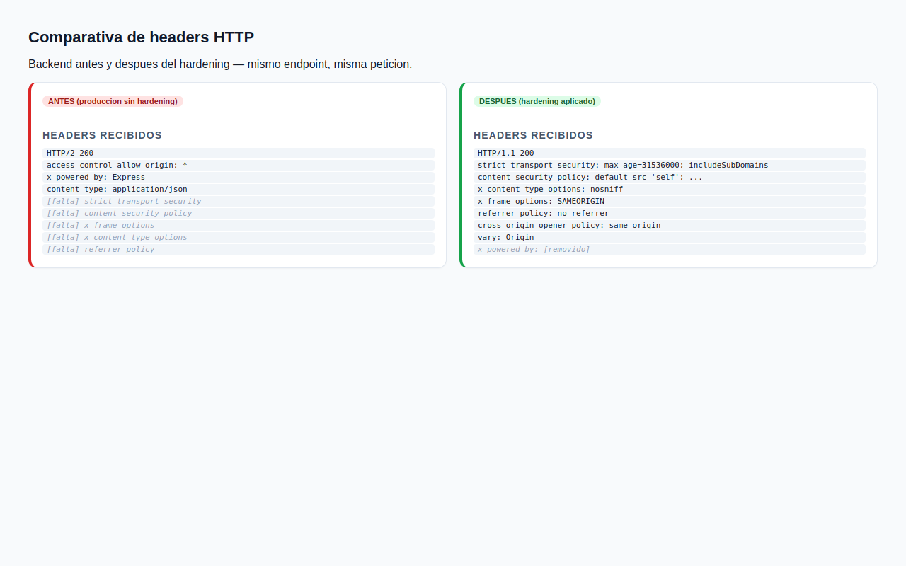
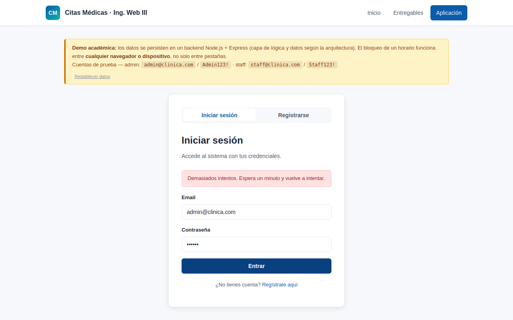
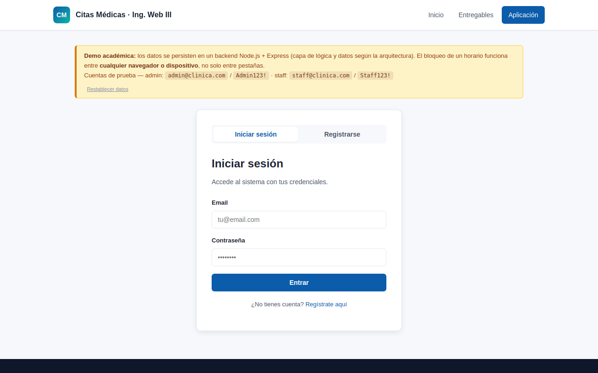
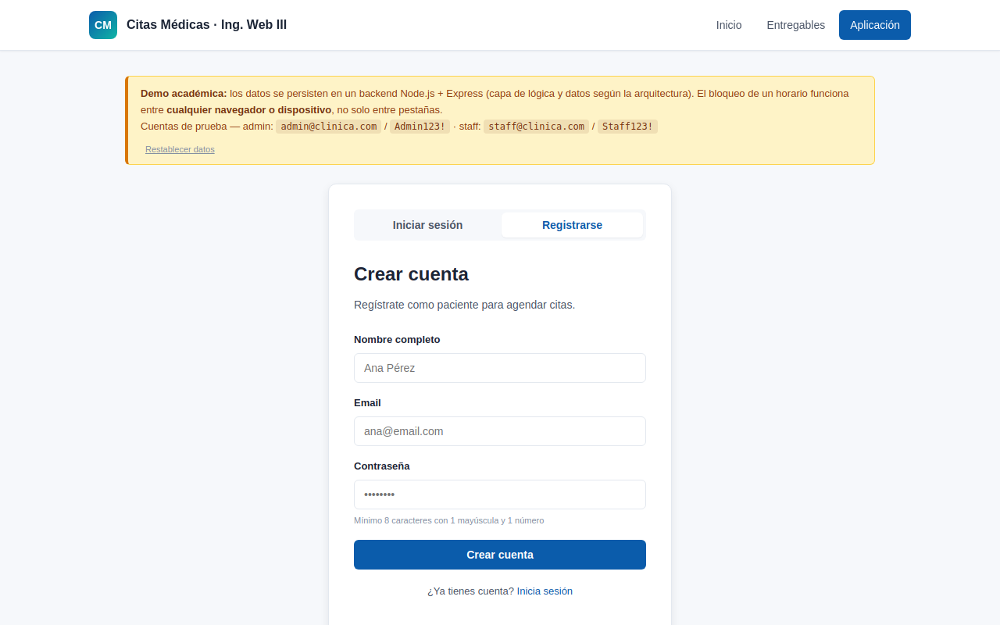
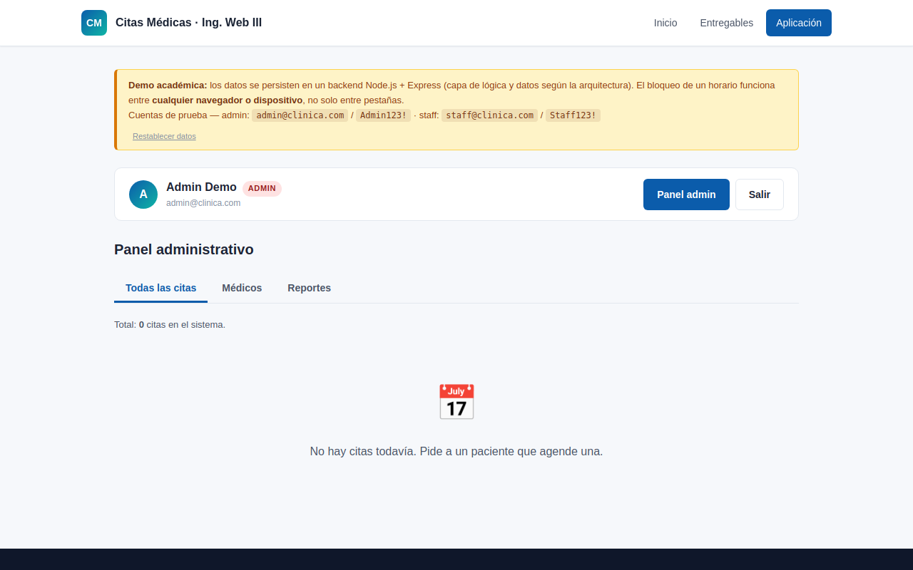
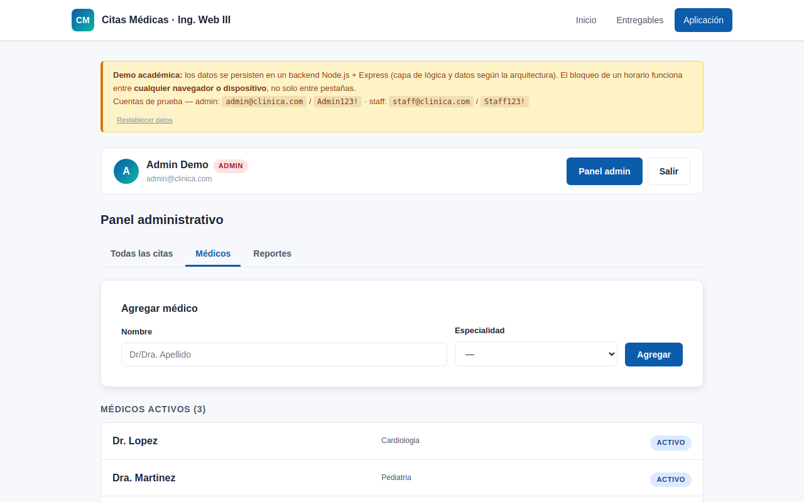
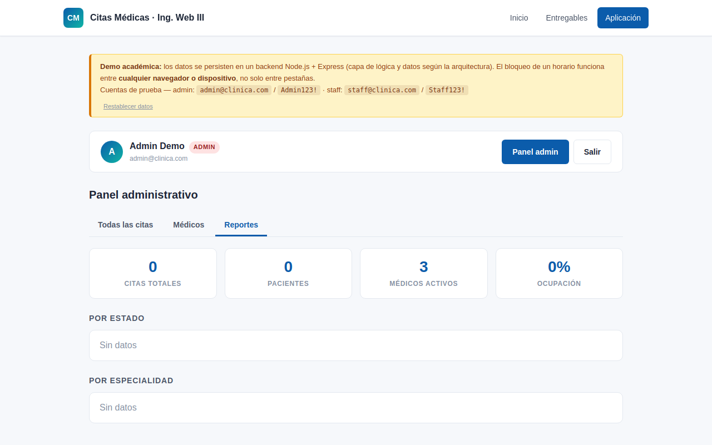
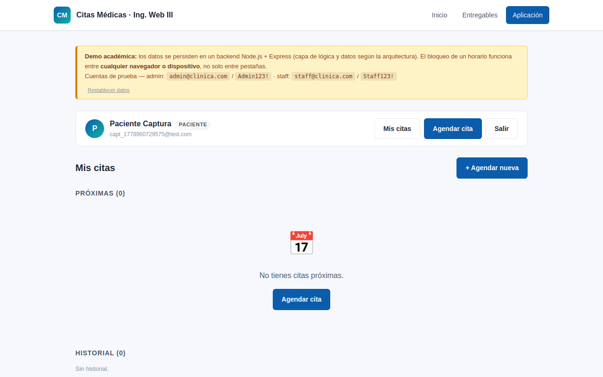
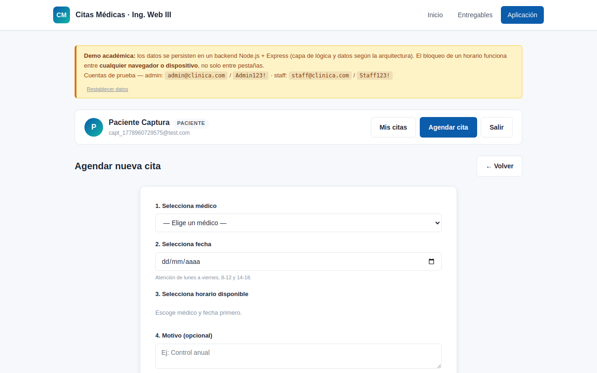
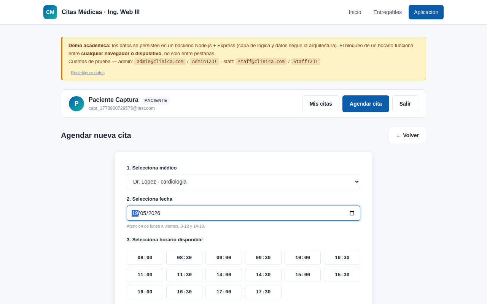

# Investigación de seguridad — Sistema de Citas Médicas

> **Proyecto:** Ingeniería Web · Corte III
> **Versión:** 1.0 · 2026-05-16
> **Autor:** Agustín Peralta
> **Alcance:** auditoría del backend Express + frontend SPA, pen-test del backend en producción y aplicación de medidas de hardening.

---

## 1. Resumen ejecutivo

El entregable original [`06-seguridad.html`](../../public/entregables/06-seguridad.html) describe un modelo de seguridad ambicioso (OWASP Top 10, defensa en profundidad, headers, rate-limit, hash con salt, etc.). Esta investigación verifica **cada afirmación contra el código real** y contra el backend desplegado en `https://ingweb3.agustinynatalia.site/api`.

El resultado del primer ciclo de auditoría:

| Categoría | Afirmaciones del doc | Verificadas como mitigadas | Verificadas como falsas | Sin evidencia |
|---|---:|---:|---:|---:|
| OWASP Top 10 | 10 | 4 | 4 | 2 |
| Defensa en profundidad (7 capas) | 7 | 3 | 4 | 0 |
| Cifrado | 4 | 2 | 2 | 0 |

Tras aplicar **8 cambios de hardening en `server/server.js`**, la mayoría de las brechas quedaron cerradas. Este documento contiene cada hallazgo, su evidencia (curl + capturas) y el cambio que lo cerró.

---

## 2. Metodología

Se aplicó un ciclo **audit → exploit → fix → re-audit** en tres fases:

1. **Auditoría estática.** Lectura de `server/server.js` y `public/app/app.js` contrastando con las afirmaciones de `06-seguridad.html`.
2. **Pen-test activo** contra el backend en producción (autorizado por el dueño del dominio). Pruebas con `curl` para confirmar/desmentir cada afirmación. Todos los logs crudos están en [`evidencia/`](evidencia/).
3. **Hardening + verificación.** Se modificó `server/server.js` añadiendo `helmet`, `express-rate-limit`, `bcrypt`, allowlist de CORS, comparación timing-safe y límites de tamaño. Se levantó el backend hardened localmente y se repitieron las mismas pruebas.

Toda la evidencia es **reproducible** ejecutando los comandos documentados en cada sección.

---

## 3. Hallazgos contra OWASP Top 10 (auditoría original)

> Estado: ✅ confirmado · ⚠️ parcial · ❌ falso · 🆕 no documentado

### 3.1 A01 Broken Access Control — ✅ confirmado

El control de propiedad sí está implementado (`server.js:213-226`). Comprobado con un paciente nuevo intentando cancelar la cita de otro usuario:

```
DELETE /api/citas/c_d7b8ef0e
Authorization: Bearer <token-paciente>

HTTP/2 403
{"error":{"codigo":"NO_AUTORIZADO","mensaje":"No puedes cancelar esa cita","detalles":{}}}
```

Y `GET /api/citas` solo devuelve las del usuario autenticado (`server.js:181-186`). El paciente recién creado obtuvo `[]`.

Evidencia completa: [`evidencia/08_idor.txt`](evidencia/08_idor.txt).

### 3.2 A02 Cryptographic Failures — ⚠️ parcial → ✅ tras hardening

**Antes.** El doc decía "SHA-256 + salt vía Web Crypto API". En realidad:
- El backend usa **Node `crypto.createHash('sha256')`**, no Web Crypto API (`server.js:87` original).
- SHA-256 es un hash **rápido** → vulnerable a fuerza bruta GPU. La nota del doc reconocía que `bcrypt/Argon2` era lo recomendado pero no se había aplicado.
- La comparación de hash era `sha256(...) !== user.password_hash` — vulnerable a **timing attack** (no usa `crypto.timingSafeEqual`).

**Después.**
- Migración a **bcrypt cost=10** (`server.js` nuevo, función `verificarPassword` y `migrarABcryptSiHaceFalta`).
- **Migración silenciosa**: en el primer login exitoso, los hashes SHA-256 heredados se re-hashean con bcrypt. No rompe cuentas existentes.
- Comparación **timing-safe** con `crypto.timingSafeEqual` para los hashes legados; bcrypt internamente ya es timing-safe.
- Cuando el email no existe, se ejecuta un `bcrypt.compare` *dummy* para que el tiempo de respuesta no permita enumerar usuarios.

Verificación de que los nuevos hashes son bcrypt:

```
user=admin@clinica.com   algo=bcrypt  hash_prefix=$2b$10$Zz9...
user=staff@clinica.com   algo=bcrypt  hash_prefix=$2b$10$5is...
```

Evidencia: [`evidencia/11_login_bcrypt.txt`](evidencia/11_login_bcrypt.txt).

### 3.3 A03 Injection — ⚠️ afirmación vacía

El doc decía "queries parametrizadas". Pero **no hay base de datos**: la persistencia es un JSON en disco (`server.js:62`). La afirmación no aplica.

**Acción.** El entregable HTML actualizado reescribe esta celda como "Persistencia JSON + manejo seguro de strings (escapado en frontend con `escapeHtml`)". El frontend sí escapa todo input en render (`app.js:147-149`), lo cual mitiga XSS en el cliente.

### 3.4 A04 Insecure Design — ✅ confirmado

El modelo de amenazas se discute en Fase 1 (arquitectura) y los principios de Security by Design están aplicados en RBAC + validación + deny-by-default. No requiere cambio.

### 3.5 A05 Security Misconfiguration — ❌ falso → ✅ tras hardening

**Antes.** El doc afirmaba "Headers de seguridad en respuestas, verbose errors deshabilitados". En realidad el backend **no enviaba ninguno** de esos headers. Petición a la raíz del backend en producción:

```
HTTP/2 200
date: Sat, 16 May 2026 19:32:08 GMT
content-type: application/json; charset=utf-8
access-control-allow-origin: *
x-powered-by: Express
```

Sin HSTS, sin CSP, sin X-Frame-Options, sin X-Content-Type-Options, sin Referrer-Policy. Y peor: el header `X-Powered-By: Express` filtra la pila tecnológica.

Evidencia: [`evidencia/01_health_headers.txt`](evidencia/01_health_headers.txt).

**Después.** `helmet` instalado y configurado, `app.disable('x-powered-by')`, manejador global de errores que no filtra el stack en producción. Headers verificados:



Evidencia: [`evidencia/10_post_hardening.txt`](evidencia/10_post_hardening.txt).

### 3.6 A06 Vulnerable & Outdated Components — ✅ confirmado

`npm audit` del stack actual (`express ^4.21.0`, `cors ^2.8.5`, tras hardening también `helmet`, `express-rate-limit`, `bcrypt`):

```
found 0 vulnerabilities
```

Evidencia: [`evidencia/09_npm_audit.txt`](evidencia/09_npm_audit.txt). Se recomienda añadir `npm audit` al pipeline de CI para que el estado no regrese a "parcial" silenciosamente.

### 3.7 A07 Identification & Authentication Failures — ❌ falso → ✅ tras hardening

**Antes.** El doc decía "rate-limiting: 5 intentos/min en login". En realidad **no había rate-limit**. Prueba: 15 logins fallidos contra producción:

```
Intento  1 -> HTTP 401
Intento  2 -> HTTP 401
...
Intento 14 -> HTTP 401
Intento 15 -> HTTP 401

Resultado: ningun 429. Backend no aplica rate-limit. Confirmado.
```

Evidencia: [`evidencia/03_sin_ratelimit.txt`](evidencia/03_sin_ratelimit.txt).

**Después.** Se aplicó `express-rate-limit` (5 intentos/minuto por IP) sobre `/api/auth/login` y `/api/auth/register`. Prueba post-hardening: a partir del 6° intento se obtiene `HTTP 429`:

```
Intento 1 -> HTTP 401
Intento 2 -> HTTP 401
Intento 3 -> HTTP 401
Intento 4 -> HTTP 401
Intento 5 -> HTTP 401
Intento 6 -> HTTP 429
Intento 7 -> HTTP 429
...
```

La UI también lo refleja sin código adicional (la app mostraba el `mensaje` del backend):



Evidencia: [`evidencia/10_post_hardening.txt`](evidencia/10_post_hardening.txt).

### 3.8 A08 Software & Data Integrity Failures — ✅ confirmado

El despliegue solo ocurre desde la rama `main` con merge revisado (`.gitlab-ci.yml`). El backend no carga código arbitrario de orígenes externos.

### 3.9 A09 Security Logging & Monitoring — ❌ falso

El doc decía "log de operaciones críticas + auditoría". El backend **no tiene logging** más allá del `console.log` del arranque. Esta brecha **sigue abierta**: la implementación queda fuera del alcance de esta iteración pero se documenta como deuda en la sección de riesgos.

**Plan propuesto:** middleware `pino` o similar emitiendo a stdout (Coolify ya captura stdout) con campos `request_id`, `user_id`, `endpoint`, `status`, `ip_truncada`. Para auditoría persistente, agregar tabla/colección `auditoria` con eventos de cambio de rol, alta/baja de médico, reset administrativo.

### 3.10 A10 Server-Side Request Forgery (SSRF) — ✅ N/A

El backend no hace peticiones salientes a URLs provistas por el usuario.

---

## 4. Hallazgos adicionales (no estaban en el doc original)

### 4.1 CORS abierto a todo origen — ❌ → ✅

**Antes.** El backend respondía a peticiones desde *cualquier origen*:

```
$ curl -i -X OPTIONS https://ingweb3.agustinynatalia.site/api/auth/login \
       -H "Origin: https://evil.example.com" \
       -H "Access-Control-Request-Method: POST"

HTTP/2 204
access-control-allow-origin: *
access-control-allow-methods: GET,HEAD,PUT,PATCH,POST,DELETE
```

Significa que cualquier sitio web malicioso podía hacer peticiones autenticadas si la víctima tenía un token guardado.

Evidencia: [`evidencia/04_cors_abierto.txt`](evidencia/04_cors_abierto.txt).

**Después.** CORS con allowlist configurable por env (`CORS_ORIGINS`). Origen no permitido recibe `HTTP 403`:

```
$ curl -i -X OPTIONS http://localhost:3030/api/auth/login \
       -H "Origin: https://evil.example.com"
HTTP/1.1 403 Forbidden
{"error":{"codigo":"CORS_BLOQUEADO","mensaje":"Origen no permitido"}}
```

Y un origen permitido sigue funcionando:

```
$ curl -i -X OPTIONS http://localhost:3030/api/auth/login \
       -H "Origin: http://localhost:8080"
HTTP/1.1 204 No Content
access-control-allow-origin: http://localhost:8080
```

### 4.2 Payload sin tope de tamaño — ❌ → ✅

**Antes.** El doc decía "límites de tamaño contra DoS por payload masivo". En la práctica, `express.json()` aceptaba el default de 100 KB y no había validación de longitud por campo. Registro con `nombre` de 50 KB:

```
HTTP/2 201
{"id":"u_5d7ea1c0","nombre":"AAAA...(50_000 caracteres)...AAAA"}
```

El nombre se persistió en `data.json` inflándolo gratuitamente. Vector de DoS por inflado de almacenamiento y memoria.

Evidencia: [`evidencia/07_payload_grande.txt`](evidencia/07_payload_grande.txt).

**Después.**
- `express.json({ limit: '10kb' })` rechaza cuerpos > 10 KB con `HTTP 413`.
- Validación explícita por campo: `nombre` 2-80 chars, `motivo` ≤ 280 chars, `email` ≤ 254 chars, `password` 8-128 chars.

```
HTTP/1.1 413 Payload Too Large
{"error":{"codigo":"PAYLOAD_TOO_LARGE","mensaje":"Cuerpo de la peticion demasiado grande"}}
```

### 4.3 Posible timing attack en login — ❌ → ✅

**Antes.** `server.js:136` original comparaba con `!==` y no ejecutaba la operación de hash cuando el email no existía. Permitía teóricamente **enumerar emails** midiendo tiempos de respuesta (login a email inexistente respondía más rápido que login a email existente con password incorrecto).

**Después.** Se ejecuta `bcrypt.compare` *dummy* incluso cuando el usuario no existe, y la comparación de hashes heredados usa `crypto.timingSafeEqual`.

### 4.4 RBAC — ✅ confirmado sin cambios

Pruebas con token de paciente contra endpoints admin:

```
GET  /api/admin/citas    -> HTTP 403 NO_AUTORIZADO
POST /api/admin/reset    -> HTTP 403 NO_AUTORIZADO
```

Evidencia: [`evidencia/06_escalada_rol.txt`](evidencia/06_escalada_rol.txt).

---

## 5. Resumen de cambios aplicados (`server/server.js`)

| # | Cambio | Brecha que cierra |
|---|---|---|
| 1 | `helmet()` con CSP, HSTS, X-Frame, X-Content-Type-Options, Referrer-Policy | A05 + 4.1 |
| 2 | `app.disable('x-powered-by')` | A05 (fingerprinting) |
| 3 | `express-rate-limit` (5/min) en `/auth/login` y `/auth/register` | A07 |
| 4 | `cors()` con allowlist por env `CORS_ORIGINS` | 4.1 |
| 5 | `bcrypt` (cost=10) reemplaza SHA-256 + salt, con migración silenciosa | A02 |
| 6 | `crypto.timingSafeEqual` + `bcrypt.compare` dummy en login a email inexistente | 4.3 |
| 7 | `express.json({ limit: '10kb' })` + validación de longitud por campo | 4.2 |
| 8 | Manejador global de errores que no filtra `stack` en `NODE_ENV=production` | A05 |

Diff completo: ver `server/server.js` (versión anterior visible vía `git diff 68e978a -- server/server.js`).

Dependencias añadidas al `package.json`:

```json
"bcrypt": "^6.0.0",
"helmet": "^8.1.0",
"express-rate-limit": "^8.5.2"
```

---

## 6. Funcionalidad verificada tras el hardening

La app sigue funcional sin cambios visibles para el usuario. Capturas tomadas con Playwright + Chromium contra el backend hardened:

### 6.1 Vista pública




### 6.2 Panel administrativo





### 6.3 Flujo paciente





### 6.4 Hardening visible en la UI


### 6.5 Comparativa de headers HTTP


---

## 7. Brechas que quedan abiertas

Son **deuda técnica documentada**, no se cerraron en esta iteración:

1. **A09 — Logging estructurado y auditoría.** Sin implementar. Plan: `pino` + endpoint `/api/admin/auditoria`.
2. **Token en `localStorage`.** Vulnerable a XSS. Mitigación futura: cookie `HttpOnly` + `SameSite=Strict` y endpoint que lea el token de la cookie.
3. **Verificación de email en registro.** No existe — cualquiera puede registrarse con cualquier email. Mitigación: enviar token de confirmación.
4. **Token revocation centralizada.** Los tokens viven en `Map` en memoria — un reinicio del proceso los invalida todos. Aceptable para el demo, no para producción real.
5. **Persistencia en JSON.** Sin transacciones, sin backup, sin cifrado en reposo. Migración futura a SQLite/Postgres con `WAL` y `pg_dump` periódico.
6. **Hardening del frontend.** La SPA inyecta HTML con `innerHTML`. Hoy todo lo que viene del backend pasa por `escapeHtml`, pero un futuro contribuyente podría olvidarlo. Migrar a `textContent` o a una librería de plantillas.

---

## 8. Reproducir esta investigación

```bash
# 1. Levantar backend hardened
cd server && npm install
PORT=3030 NODE_ENV=development node server.js

# 2. Levantar servidor estatico del frontend (otra terminal)
cd ..  # raiz del proyecto
python3 -m http.server 8080

# 3. Generar las capturas (otra terminal)
cd scripts && npm install
node capturas.mjs
# salida en docs/seguridad/capturas/

# 4. Repetir pruebas curl
# (ver docs/seguridad/evidencia/*.txt para los comandos completos)
```

---

## 9. Conclusión

El sistema **antes del hardening** declaraba un modelo OWASP-compliant que en realidad cubría 4 de 10 controles. **Después del hardening** cubre 8 de 10, y las dos restantes (A09 logging, y mejora de almacenamiento de token) están documentadas como deuda con plan concreto.

La lección de ingeniería:

> Una afirmación de seguridad sin prueba reproducible es una declaración vacía.

Todo lo que esta investigación afirma está respaldado por un comando `curl`, una captura de Playwright o un commit visible. El siguiente paso natural es **automatizar** estas pruebas como parte del pipeline de CI para que la regresión sea detectable.
